# Action Item: Modern Frontend Tooling 🛠️

In this **Action Item**, you will:

- 📦 Setup `webpack` as a `module bundler` with basic configuration
- 📓 Configure `babel` to transpile your code(depending on target browsers)
- ⚙️ Extend the `module bundler` configuration to be able to use `JSX` in your code base
- 🤖 Enable `TypeScript` in your code base by adding the `TS` loader to `webpack`
- ✨ Use `ESlint`, `Prettier` and `Git Hooks` to enforce code quality

_**The difficulty increases gradually, and we recommend you complete the items in the given order.**_

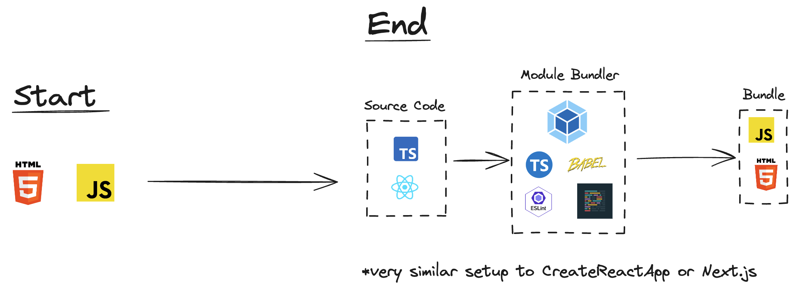
**_Our objective: go from a simple static website with HTML and JavaScript to a setup similar to CreateReactApp or any modern framework like Next.js._**

## 🚀 Challenges
- [X] 1. **🟢 EASY** - Setup `npm` to manage dependencies
- [ ] 2. **🟢 EASY** - Setup `Webpack` to bundle your code
- [ ] 3. **🟢 EASY** - Build for any browser with `Babel`
- [ ] 4. **🟢 EASY** - Use `Webpack` plugins to set up `cache busting` 
- [ ] 5. **🟡 MEDIUM** - Add React to leverage `JSX` and OOP with `Components`
- [ ] 6. **🟡 MEDIUM** - Extend the `webpack` configuration to use `TypeScript`

## 🎁 Bonus Challenges - Code Quality Tooling
- [ ] 1. **🟢 EASY** - Setup `ESlint` with `Webpack` to ensure consistent code linting across the project
- [ ] 2. **🟢 EASY** - Setup `Prettier` to ensure a consistent code style
- [ ] 3. **🟡 MEDIUM** - Setup Git Hooks to run the `linter` on `push` or `commit` as a quality measure
- [ ] 4. **🟢 EASY** - Setup A11 JSX Linter Plugin to check for accessibility mistakes
- [ ] 5. **🔴 VERY HARD** - Replicate the same setup using Vite or Rolloup(in a different repository or this one, and share the result in the community)


### Getting Started
The application used here as an example is a simple static website. To run it we recommend the following:

1. Install the [Live Server](https://marketplace.visualstudio.com/items?itemName=ritwickdey.LiveServer) extension for `VS Code`
2. Right-click on the `index.html` page and click on > `Open in Live Server`
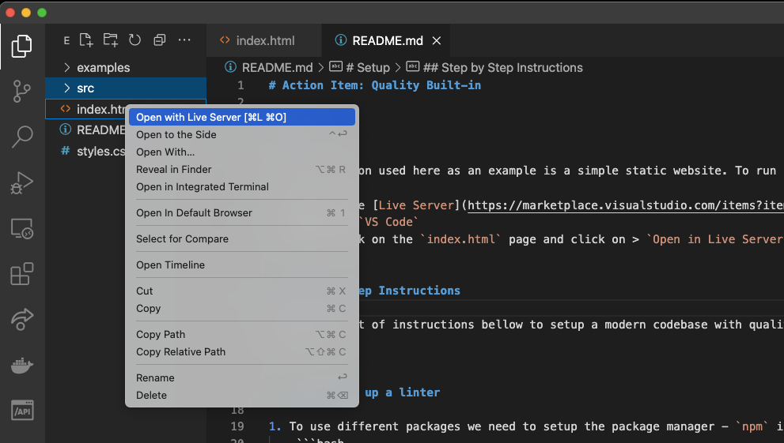

**You should see this in your browser:**

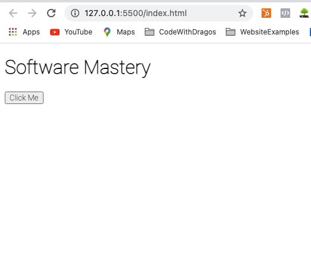

## 🏁 Check your progress with automated tests:
 
You can run your tests in the terminal:
```bash
npm run test
```

By the end of the exercise, you should make all the tests pass:
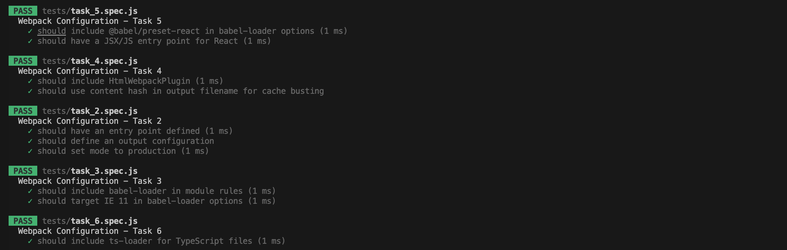

You can also run individual tests for each task:
```bash
npm run test:task_2
```

or 

```bash
npm run test:task_3
```


-----

### Step by Step Instructions

Follow the set of instructions below to set up a modern codebase for UI development and use React as a front-end library.

------
<details closed>
<summary>CLICK ME! - Walkthrough: 1. Set up npm 📦</summary>
<br>

**Note: This task was already done, and it is here just for reference, feel free to move on to the next one.**

1.1. To use different packages we need to set up the package manager - `npm` in this folder. In your terminal run:
```bash 
npm init -y
```

1.2. Add a `.gitignore` file to leave the `node_modules` out of your commits:
```bash 
echo "node_modules" > .gitignore 
```
**💡 Save the `.gitignore` file with the code editor to apply the changes.💡**

</details>


----
<details closed>
<summary>CLICK ME! - Walkthrough: 2. Set up Webpack to bundle your code 🎁</summary>
<br>

2.1. Install `webpack` as a development dependency by running:
```bash 
npm install webpack --save-dev
```

2.2. Add an empty `webpack` **configuration file**:
```bash 
echo "module.exports = {}" > webpack.config.js
```

2.3. Add an entry point to your `webpack.config.js` file:
```javascript 
const path = require("path");

module.exports = {
    entry: path.join(__dirname, "src/scripts.js"),
}
```

2.4. Add an `output` property to the `webpack` configuration file:
```javascript 
const path = require("path");

module.exports = {
    ...
    output: {
        path: path.resolve(__dirname, "build"),
        filename: "bundle.js",
    },
    mode: "production"
    ...
}
```

*Webpack will build a **[dependency graph](https://webpack.js.org/concepts/dependency-graph/)** based on our `exports/require` statements and bundle all the modules into a single file.*

2.5. Add a script to build the application for production in the `package.json` file:
```javascript 
    ...
    "scripts": {
        ...,
        "build": "webpack"
    },
    ...
```

2.6. Add `require/export` in your files so `webpack` can bundle your code:

2.6.1 Add exports at the end of the `src/askQuestionSet.js` file:
```javascript

... 
// This line at the bottom of the `src/askQuestionSet.js` file
module.exports = askQuestionSet;
```

2.6.2 Add an import to the top of `src/scripts.js` file:

```javascript
// This line at the top of the `src/scripts.js` file
const askQuestionSet = require("./askQuestionSet");

...
```

2.7. Run the `build` script and check the `/build` folder:
```bash 
npm run build
```

2.8. Add the `/build` folder to the `.gitignore file`:
```bash 
echo "build" >> .gitignore
```

**Save the `.gitignore` file with the code editor to apply the changes.**

2.9. Replace the `script` references with a single one, generated by `webpack`:
```html
    <!-- Replace this -->
    <script src="./src/askQuestionSet.js"></script>
    <script src="./src/scripts.js"></script>

    <!-- With this -->
    <script src="./build/bundle.js"></script>
```

**Open the `index.html` file with live server and check that it still works as expected.**

Check your solution by running the tests for this task in the terminal and make sure they pass:
```bash
npm run test:task_2
```

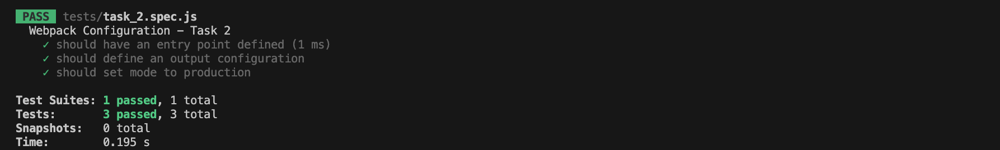

🎉 Congratulations! You are now using `Webpack` as a module bundler. 🎉

#### Solution: Task 2
- 🗂️ CODE SOLUTION - Setting up Webpack - `git checkout solution_task_2`
- 👩🏽‍💻 Video Explanation - [Setting up Webpack](https://www.loom.com/share/3f22d74f031545f79780957acdc002cc?sid=8f438df2-a4fd-4564-a30e-0d7fb665dd23)

</details>

----

<details closed>
<summary>CLICK ME! - Walkthrough: 3. Build for any browser with Babel </summary>
<br>

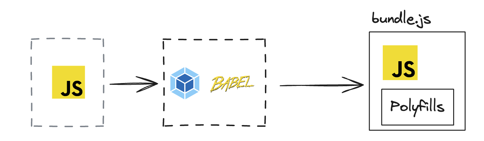

Now that we use `webpack` to bundle our code we can extend our workflow in many different ways. The most common one is to add `Babel` as a **code transpiler** so we can build for all browsers but still use the latest `Javascript` features.

> Note: Webpack and also polyfill our code by default, but `babel` has much broader support and more complete polyfills.

[You can try out Babel online here](https://babeljs.io/repl).

Checkout the [Webpack loaders docs here](https://webpack.js.org/loaders/babel-loader). 

Follow the instructions to add `babel` to your code base:

3.1. Install the `babel` loader for `webpack` by running:
```bash
npm install -D babel-loader @babel/core @babel/preset-env webpack
```

3.2. Add the module configuration to your `webpack.config.js` file:
```javascript
module: {
    rules: [
        {
        test: /\.m?js$/,
        exclude: /(node_modules|bower_components)/,
        use: {
            loader: 'babel-loader',
            options: { // our code will be compatible with Internet Explorer 11
                presets: [["@babel/preset-env", { "targets": "IE 11" }]]
            }
        }
        }
    ]
}

```

**The loader will be used by `webpack` any time a `.js` file is found. Webpack will now use babel to translate the code following the configuration.**

3.3 You can now use advanced features like the `ES6` modules in your code. To test it out:

3.3.1 Replace the `common.js` export with an `es6` one in `src/askQuestionSet.js`:
```diff
// Replace:
-module.exports = askQuestionSet;

// With:
+export default askQuestionSet;
```

3.3.2 Replace the `common.js` import with an `es6` one in `src/scripts.js`:
```diff
// Replace:
-const askQuestionSet = require("./askQuestionSet.js");

// With:
+import askQuestionSet from "./askQuestionSet.js";

```

3.4. Run the `build` script again and check the app:

```bash 
npm run build
```
Everything should work just as before.


Check your solution by running the tests for this task in the terminal and make sure they pass:
```bash
npm run test:task_3
```
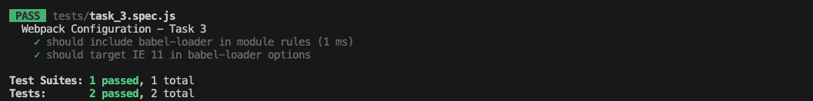

#### Solution: Task 3
- 🗂️ CODE SOLUTION - Adding Babel - `git checkout solution_task_3`
- 👩🏽‍💻 Video Explanation - [Setting up Babel](https://www.loom.com/share/5a7e82e452d74da890f4fbe8b86bbb48?sid=48c53d0f-042f-4a8d-bff9-e221d09280a1)
</details>

----

<details closed>
<summary>CLICK ME! - Walkthrough: 4. Use Webpack plugins to set up cache busting</summary>
<br>

`Webpack` offers many plugins to extend our workflow, optimize our code and improve the development experience. We will use it for now to set up [Cache Busting](https://javascript.plainenglish.io/what-is-cache-busting-55366b3ac022).

> 📝 Note: Cache Busting is a Senior Developer interview question, and we will dive deeper into it in the web performance section.

4.1. Setup `cache busting` by producing a **unique bundle name** every time:
Change the following in your `webpack.config.js` file:

```diff
...
output: {
    path: path.resolve(__dirname, "build"),
-    filename: "bundle.js",
+    filename: "[contenthash].bundle.js",
},
...
```

4.2. Run `build` and check your build folder:
```bash 
npm run build
```

The new bundle should have a unique name, containing an `unique hash`, based on its content:

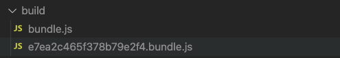

**How can we add the unique name automatically to the `index.html` file?**

4.3. Install the [HTMLWebpackPlugin](https://webpack.js.org/plugins/html-webpack-plugin/):
```bash 
npm install --save-dev html-webpack-plugin
```

4.4. Add the following to your `webpack.config.js` file:
```diff
+ const HtmlWebpackPlugin = require('html-webpack-plugin');

module.exports = {
    entry: path.join(__dirname, "src/scripts.js"),
    output: {
        path: path.resolve(__dirname, "build"),
        filename: "[contenthash].bundle.js",
    },
+   plugins: [new HtmlWebpackPlugin({
+       template: path.join(__dirname, "public", "index.html")
+   })],
    mode: "production",
    module: {
        rules: [
            {
            test: /\.m?js$/,
            exclude: /(node_modules|bower_components)/,
            use: {
                loader: 'babel-loader',
                options: { // our code will be compatible with Internet Explorer 11
                    presets: [["@babel/preset-env", { "targets": "IE 11" }]]
                }
            }
            }
        ]
    }
}
```

4.5. Create a `/public` folder(this is sort of an industry standard/convention):
```bash 
mkdir public
```

**Note: the `/public` folder will be served from a CND most likelly - is where static assets like images or font files should go.**

4.6. Move the `index.html` file to the public folder:
```bash 
mv index.html public/index.html
```

4.7. Remove the `<script>` tag from the `.html` file:
```diff
    <h1>Software Mastery</h1>
    <button id="btn-one">Click Me</button>
-   <script src="./build/bundle.js"></script>
```

4.8. Remove the `build` folder:
```bash 
rm -rf build
```

4.9. Run `build` and check your build folder:
```bash 
npm run build
```
*You should see something like this:*
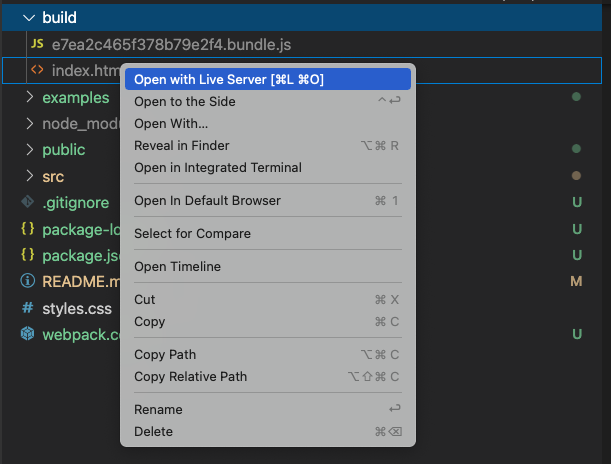

**The plugin will add the generated bundles to the `html` file automatically:**
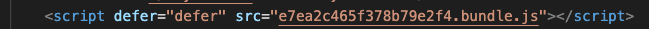

Check your solution by running the tests for this task in the terminal and make sure they pass:
```bash
npm run test:task_4
```

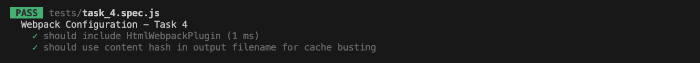

#### Solution: Task 4
- 🗂️ CODE SOLUTION - Setting up the HTMLWebpackPlugin - `git checkout solution_task_4`
- 👩🏽‍💻 Video Explanation - [Setting up Cache Busting with Webpack](https://www.loom.com/share/f24f68b42d64457d928d69560d17fbf1?sid=dd53c0f7-fd27-43ac-b4a5-b84d6dce204c)

</details>

----

<details closed>
<summary>CLICK ME! - Walkthrough: 5. Adding React to leverage JSX and OOP with Components </summary>
<br>

5.1. Add `react-presets` for `Babel` as a dependency
```bash 
npm install --save-dev @babel/preset-react
```

5.2. Add react presets to the babel config in the `webpack` file:
```diff
    mode: "production",
    module: {
        rules: [
            {
+               test: /\.m?js|jsx$/,
                exclude: /(node_modules|bower_components)/,
                use: {
                        loader: 'babel-loader',
                        options: { // our code will be compatible with Internet Explorer 11
+                       presets: ["@babel/preset-react", ["@babel/preset-env", { "targets":   "IE 11" }]]
                    }
                }
            }
        ]
    }
```

5.3. Delete our old `code` as we will use `React` instead:
```bash 
rm src/askQuestionSet.js
rm src/scripts.js
```

5.4. Add `react` and `react-dom` as a dependency:
```bash 
npm install react-dom react
```

5.5. Add the new `React` code:
```bash 
touch src/index.jsx
```
In the `src/index.jsx` file add:
```javascript
import ReactDOM from "react-dom";
import React from "react";

class App extends React.Component {
render() {
    return (
        <div>
            <h3>Hello There! What is your name?</h3>
            <input></input>   
            <button onClick={() => alert("Hello")}>Say Hello</button>
        </div>
        );
    }
}

const root = ReactDOM.createRoot(document.getElementById('root'));
root.render(<App/>);
```

5.6. Change the entry point in the `webpack.config.js` file:
```diff
module.exports = {
...
-    entry: path.join(__dirname, "src/scripts.js"),
+    entry: path.join(__dirname, "src/index.jsx"),
...
}
```

5.7. In the `public/index.html` file add:
```html
<!DOCTYPE html>
<html lang="en">
<head>
    ...
</head>
<body> 
    <div id="root"></div>
</body>
</html>
```

5.8. Run the `build`, check the build folder and the browser:
```bash 
npm run build
```

5.9. Add a `development server` to improve the experience.

5.9.1 Extend the `webpack.config.js`:
```diff
module.exports = {
...
+    devServer: {
+       port: 3000
+},
...
}
```

5.9.2 Add a `dev` command to your `npm` scripts:
```diff 
module.exports = {
    ...
"scripts": {
        ...,
+        "dev": "webpack serve"
    },
    ...
}
```

5.9.3. Run the `dev` script and check the terminal and the browser:
```bash 
npm run dev
```
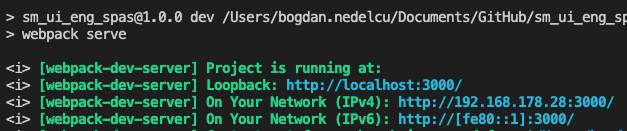

#### Congratulations, you are now using `React` with your very own Babel and Webpack setup!

Check your solution by running the tests for this task in the terminal and make sure they pass:
```bash
npm run test:task_5
```
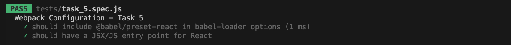

#### Solution: Task 5
- 🗂️ CODE SOLUTION - Adding `React.js` - `git checkout solution_task_5`
- 👩🏽‍💻 Video Explanation - [Adding React.js](https://www.loom.com/share/b0f3af02e88d4685b7ff9c91cc848414?sid=3d9af127-852a-4e13-a11b-637dffd0d35d)

</details>

----

<details closed>
<summary>CLICK ME! - Walkthrough: 6. Extend the webpack configuration to use TypeScript</summary>
<br>

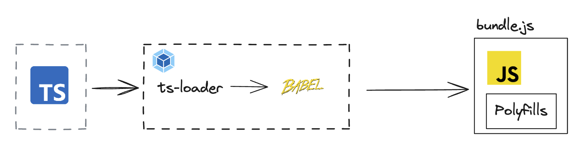

Add `Typescript` using the [ts-loader](https://webpack.js.org/guides/typescript/)

6.1 Add the needed dependencies:
```bash
npm install --save-dev typescript ts-loader
```

6.2 Extend the `webpack` configuration to use `TypeScript`:
```diff
module: {
    rules: [
    {
        test: /\.m?js$/,
        exclude: /(node_modules|bower_components)/,
        use: {
            loader: 'babel-loader',
            options: { // our code will be compatible with Internet Explorer 11
                presets: [["@babel/preset-env", { "targets": "IE 11" }]]
            }
        }  
    }
+     {
+        test: /\.tsx?$/,
+         use: 'ts-loader',
+        exclude: /node_modules/,
+      },
    ],
},
```

6.3 Add a `tsconfig.json` file in the root folder. You can use the default `React` configuration here:
```json
{
    "compilerOptions": {
        "module": "commonjs",
        "noImplicitAny": true,
        "removeComments": true,
        "preserveConstEnums": true,
        "sourceMap": true,
        "esModuleInterop": true,
        "jsx": "react"
    },
    "include": [
        "src"
    ],
    "exclude": [
        "node_modules"
    ]
}
```

6.4 Change your files from `.jsx` to `.tsx` and you can now use static typing
```javascript
import { createRoot } from 'react-dom/client';
import React from "react";

function App() {
    return (
        <div>
            <h3>Hello There! What is your name?</h3>
            <input></input>
            <button onClick={() => alert("Hello")}>Say Hello</button>
        </div>
    );
}

const root = createRoot(document.getElementById('root'));

root.render(<App />);
```

You will need to install the react types to avoid any type errors. In your terminal:
```
npm i --save-dev @types/react-dom
```

6.5 Change your entry point in the `webpack.config.js` file to match the `.tsx` file:
```diff
module.exports = {
    ...
    mode: "development",
-   entry: path.join(__dirname, "src/index.tsx"),
+   entry: path.join(__dirname, "src/index.tsx"),
    ...
}
```

6.6 Run the app again and make sure everything compiles:
```bash
npm run dev
```

Check your solution by running the tests for this task in the terminal and make sure they pass:
```bash
npm run test:task_6
```


#### Solution: Task 6
- 🗂️ CODE SOLUTION - Adding `TypeScript` - `git checkout solution_task_6`
- 👩🏽‍💻 Video Explanation - [Adding TypeScript](https://www.loom.com/share/3f0c5b1decd940ffa0e59c90ecc8290f?sid=f6f60405-cf76-43c2-9b58-eb09ec347947)

</details>

----

### Step by Step Instructions for the 🎁 Bonus Challenges

---

<details closed>
<summary>CLICK ME! - Walkthrough: Bonus Task 1. Setup ESLint with Webpack</summary>
<br>

`Eslint` helps in identifying and reporting on patterns found in ECMAScript/JavaScript code, to make code more consistent and avoiding bugs.

1. Initialize ESLint configuration:
```bash 
npx eslint --init
```

2. Follow the prompts to set up ESLint based on your preferences (style, frameworks used, etc):

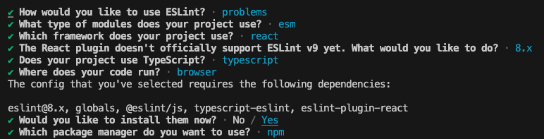

2.0 You will have to install some config dependencies, `eslint` will do it for you, just select `yes` when prompted:

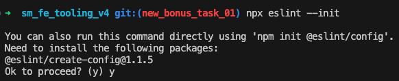

2.1 Due to compatibility issues, we had to install `eslint v8.0`:
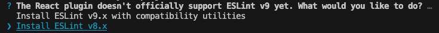

3. Once configured, you can add a script in your `package.json` to run Eslint:
```json
"scripts": {
    "lint": "eslint /src --fix"
}
```

> Note: The `--fix` flag will automatically fix some of the issues found by `ESLint`.

4. Run `ESLint` to check your code:
```bash
npm run lint
```

ESLint will now check your code for any issues based on the rules specified in your configuration.

To make `ESLint` work with VS code you need to install the [ESLint VSCode plugin from here](https://marketplace.visualstudio.com/items?itemName=dbaeumer.vscode-eslint).


5. You migh need to tweak the configuration to make it work well with `React`. In our case, we had to add the detect config, see below our final configuration:

```diff
import globals from "globals";
import pluginJs from "@eslint/js";
import tseslint from "typescript-eslint";
import pluginReactConfig from "eslint-plugin-react/configs/recommended.js";

export default [
  {files: ["src/**/*.{js,mjs,cjs,ts,jsx,tsx}"]},
  { languageOptions: { parserOptions: { ecmaFeatures: { jsx: true } } } },
  {languageOptions: { globals: globals.browser }},
  pluginJs.configs.recommended,
  ...tseslint.configs.recommended,
  pluginReactConfig,
+ {settings: { react: { version: "detect" } }}
];
```

##### Now we can integrate `linting` in our build process, so every time we build the application, we also check the code quality.

6. Install the `Webpack` plugin for `ESLint`:
```bash
npm install eslint-webpack-plugin --save-dev
```
See [the plugin documentation here](https://webpack.js.org/plugins/eslint-webpack-plugin/).

7. And extend the `webpack.config.js` file:
```diff
+const ESLintPlugin = require('eslint-webpack-plugin');

module.exports = {
  // ...
  plugins: [
    new HtmlWebpackPlugin({
      template: path.join(__dirname, "public", "index.html"),
    }),
+   new ESLintPlugin({
+      extensions: ['ts', 'tsx', 'js', 'jsx'], 
+      fix: true, 
+      configType: 'flat',
+      eslintPath: 'eslint/use-at-your-own-risk',
+   })
  ],
};
```

> Note: As `eslint` version 9.0 is still being adopted some compatibility issues might appear. 

You will now get `ESLint` warnings and errors every time you build the application.

You can check `ESLlint` works by adding an unused constant to our `index.jsx` file:
```diff
import { createRoot } from 'react-dom/client';
import React from "react";

+const test = "an unused constant";

function App() {
    return (
        <div>
            <h3>Hello There! What is your name?</h3>
            <input></input>
            <button onClick={() => alert("Hello")}>Say Hello</button>
        </div>
    );
}

const root = createRoot(document.getElementById('root'));

root.render(<App />);
```

And then run the `lint` script:
```bash
npm run lint
```

You should see the following error:

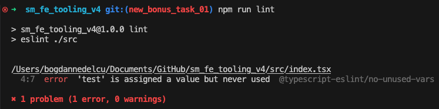


#### Congratulations, you are now using `ESLint` to enforce code quality in your project!

### Linter Setup for Jest
To be able to use jest global variables like `test` and `describe` we need to extend our `ESLint` configuration. Add the following to the `eslint.config.js`. First install the `eslint-plugin-jest`:
```bash
npm install eslint-plugin-jest --save-dev
```

And then extend the `eslint.config.js` file like this:
```diff
+import jest from 'eslint-plugin-jest'

export default [
  {files: ["src/**/*.{js,mjs,cjs,ts,jsx,tsx}"]},
  { languageOptions: { parserOptions: { ecmaFeatures: { jsx: true } } } },
  {languageOptions: { globals: globals.browser }},
  pluginJs.configs.recommended,
  ...tseslint.configs.recommended,
+ jest.configs['flat/style'],
  pluginReactConfig,
  {settings: { react: { version: "detect" } }}
];
```
> Note: open any of the tests files and check if the `describe` and `test` functions are recognized by the linter. You should have no linting errors.

#### Solution: Bonus Task 1
- 🗂️ CODE SOLUTION - Setting up `ESLint` - `git checkout new_bonus_task_01`

</details>

---

<details closed>
<summary>CLICK ME! - Walkthrough: Bonus Task 2. Setup Prettier</summary>
<br>

Prettier is an opinionated code formatter that supports many file types and enforces a consistent style.

1. Install Prettier:
```bash 
npm install --save-dev eslint-plugin-prettier eslint-config-prettier
npm install --save-dev --save-exact prettier
```

2. Create a `.prettierrc` file to configure Prettier:
```bash 
echo "{}" > .prettierrc
```

> Note: We will leave the configuration empty for now, but you can customize it to fit your needs.

3. Add the `prettier` preset to your `eslint` configuration:
```diff
extends:
...
import pluginJs from "@eslint/js";
import tseslint from "typescript-eslint";
import pluginReactConfig from "eslint-plugin-react/configs/recommended.js";
+import eslintPluginPrettierRecommended from "eslint-plugin-prettier/recommended";

export default [

  ...
  pluginJs.configs.recommended,
  ...tseslint.configs.recommended,
  pluginReactConfig,
  { settings: { react: { version: "detect" } } },
+ eslintPluginPrettierRecommended
];


```

4. Run the linter again, and have it format your code with prettier according to the rules specified in your `.prettierrc` file:
```bash
npm run lint
```

**NOTE: Prettier is optional, for most projects, `Eslint` is enough.**

To make `Prettier` work as the default formatter in VSCode you need to install the [VSCode plugin for Prettier from here](https://marketplace.visualstudio.com/items?itemName=esbenp.prettier-vscode).

#### Solution: Bonus Task 2
- 🗂️ CODE SOLUTION - Setting up `Prettier` as code formatter - `git checkout new_bonus_task_02`

</details>

---

<details closed>
<summary>CLICK ME! - Walkthrough: Bonus Task 3. Setup Git Hooks</summary>
<br>

Git Hooks can be used to run scripts at certain points in Git's execution process. This will enforce code quality and prevent bad code from being committed.

1. Install Husky, which simplifies the use of Git hooks:
```bash 
npx husky-init && npm install
```

2. Edit the husky pre-commit hook in `.husky/pre-commit` to run your linter and tests:
```bash
#!/bin/sh
. "$(dirname "$0")/_/husky.sh"

npm run lint && npm test
```

3. Make a change to your code, stage that change and commit:
```bash
git add .
git commit -m "some commit name here"
```

You should see the linter and tests run before the commit is made:
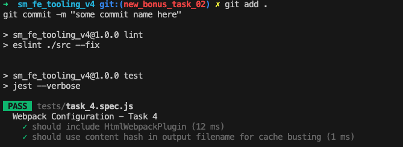

4. [Optional] Setup `lint-staged` so we only lint and format the code that has changed in the commit, not the whole codebase. This will make the pre-commit hooks faster on larget codebases and make sure the developer experience is still great. [Check out the docs here](https://github.com/lint-staged/lint-staged?tab=readme-ov-file#installation-and-setup).

With these hooks, your code will be automatically linted and tested before each commit or push, helping to maintain code quality.

#### Solution: Bonus Task 3
- 🗂️ CODE SOLUTION - Setting up `Git Hooks` with `husky` - `git checkout new_bonus_task_03`

</details>

----

<details closed>
<summary>CLICK ME! - Walkthrough: Bonus Task 4 - Setup A11 JSX Linter Plugin for web accessibility checks </summary>
<br>

We can now extend our tooling to make sure it also helps us write applications that follow **Web Accessibility** best practices. We will use [this linter plugin for this](https://www.npmjs.com/package/eslint-plugin-jsx-a11y).

> Note: Most single page application frameworks include this plugin out of the box - is an industry best practice.

1. Install the a11y plugin for the linter:
 ```bash 
 npm install eslint-plugin-jsx-a11y --save-dev
 ```

2. Extend the linter configuration:
```diff
import tseslint from "typescript-eslint";
import pluginReactConfig from "eslint-plugin-react/configs/recommended.js";
import eslintPluginPrettierRecommended from "eslint-plugin-prettier/recommended";
+import jsxA11y from "eslint-plugin-jsx-a11y";

export default [
  ...,
  pluginReactConfig,
  { settings: { react: { version: "detect" } } },
  eslintPluginPrettierRecommended,
+ jsxA11y.flatConfigs.recommended
];
```

3. Test your config. In the react app, add an `` element without the `alt` text attribute:
```diff
import { createRoot } from "react-dom/client";
import React from "react";

function App() {
  return (
    <div>
      <h3>Hello There! What is your name?</h3>
      <input onChange={() => console.log("test")}></input>
      <button onClick={() => alert("Hello")}>Say Hello</button>
+     </img>
    </div>
  );
}

const root = createRoot(document.getElementById("root"));

root.render(<App />);
```

And then save the file.

4. Run the linter in your terminal:
```bash
npm run lint
```

5. You should see the following error:
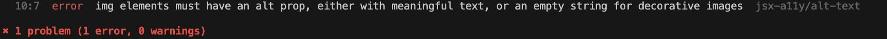

6. Add an `alt` text to make the linter rule pass:
```diff
import { createRoot } from "react-dom/client";
import React from "react";

function App() {
  return (
    <div>
      <h3>Hello There! What is your name?</h3>
      <input onChange={() => console.log("test")}></input>
      <button onClick={() => alert("Hello")}>Say Hello</button>
-     </img>
+     </img>
    </div>
  );
}

const root = createRoot(document.getElementById("root"));

root.render(<App />);
```

> Note: we will dive deeper into `Accessibility` later in this chapter, for now just keep in mind we can use the linter to automatically check for some common accessibility mistakes directly in our code editor.

#### Solution: Bonus Task 4
- 🗂️ CODE SOLUTION - Setting up the `A11Y` plugin - `git checkout solution_bonus_task_4`

</details>

----

<details closed>
<summary>CLICK ME! - Walkthrough: Bonus Task 5. Alternative setup with Vite</summary>
<br>

🌟 A true **senior** can apply the mental models and methodologies regardless of the implementation. In this task, we challenge you to re-create the same setup, by yourself using a completely different set of tools of your choice. We recommend you try:

1. 📦 Module bundler - use [Vite](https://vitejs.dev/)
2. 🖼️ Component Framework - use [Vue.js](https://vuejs.org/)

We give you complete freedom on the rest of the choices. Once you are done, share your setup and your choices in the [Community](https://www.skool.com/software-mastery) or the [Weekly Coaching Calls](https://www.skool.com/software-mastery/calendar) to get feedback.

🍀 Good Luck!

</details>

----
### Next Steps 🚀

1. **Push your code** - Make sure all the tests pass before that ✅
2. **Look into your current code base** at work or in your project and apply what we have learned. Focus on:
   - `webpack` configurations 🔧
   - Checking the output of the `npm run build` command 🏗️
   - TypeScript, Linter, Prettier, and all other dev tools, especially their config files 🛠️

   Take notes 📝 and ask yourself what would you do differently and why? 🤔
3. **Move on to the next part of *Frontend Mastery*** 💻
----

### Getting Help
If you have issues with the Action Item, you can ask for help in the [Community](https://www.skool.com/software-mastery) or in the [Weekly Coaching Calls](https://www.skool.com/software-mastery/calendar).


### Made with :orange_heart: in Berlin by @TheSeniorDev
